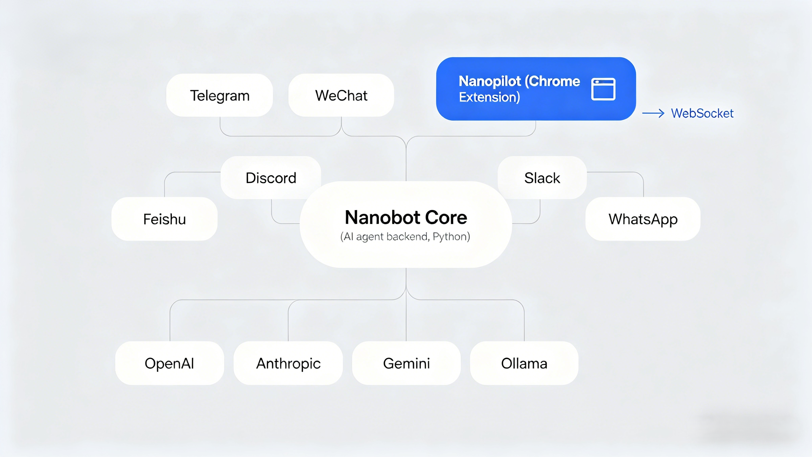
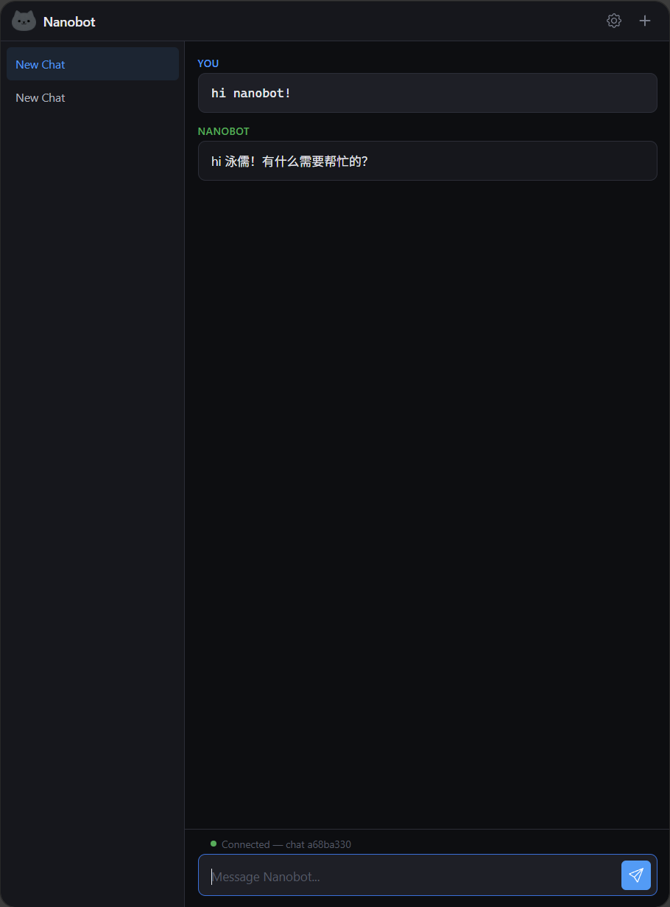
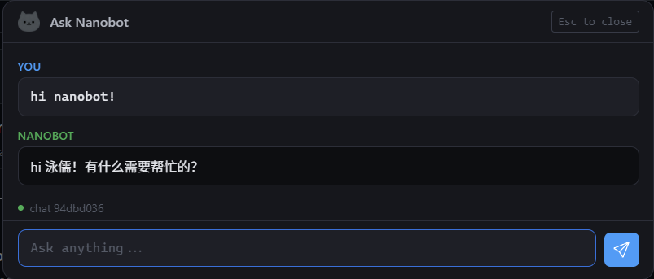

# Nanopilot

<p align="center">
  
</p>

<p align="center">
  Chat with Nanobot without leaving your browser.
</p>

Open a side panel for persistent multi-session conversations, or hit <kbd>Ctrl</kbd>+<kbd>Shift</kbd>+<kbd>K</kbd> for a quick question on any page.

---

## Install

### End Users

```bash
git clone https://github.com/chengyongru/Nanopilot.git
```

Then in Chrome: `chrome://extensions` → enable **Developer mode** → **Load unpacked** → select the **`dist/`** folder.

### Developers

```bash
git clone https://github.com/chengyongru/Nanopilot.git
cd Nanopilot
npm install
npm run build        # build to dist/
npm test             # run tests
npm run test:watch   # tests in watch mode
npm run test:coverage # tests with coverage report
npm run dev          # build in watch mode
```

Load the **`dist/`** folder in Chrome for development.

Pin it to your toolbar via the puzzle icon.

## Quick Start

1. Install Nanopilot from the [latest release](https://github.com/chengyongru/Nanopilot/releases) — see [Setup Guide](docs/setup.md) for details
2. Ask your Nanobot to configure its WebSocket channel (the setup guide has a ready-to-use prompt)
3. Paste the 5 values into Nanopilot's Settings → Save
4. Start chatting

## Architecture

<p align="center">
  
</p>

## Screenshots

| Side Panel | Quick Chat |
|:---:|:---:|
|  |  |

## What's Inside

- **Side Panel** — persistent chat with session management
- **Ctrl+Shift+K Quick Chat** — Cursor-style overlay, ask and dismiss
- **Streaming** — real-time token output, no waiting
- **Token auth** — auto-issues short-lived tokens, secret stays local
- **Multi-session** — conversations persist across restarts

## Docs

| Doc | What's in it |
|-----|-------------|
| [Setup Guide](docs/setup.md) | Nanobot config, extension settings, TLS |
| [Architecture](docs/architecture.md) | File structure, data flow, design decisions |

## Compatibility

Chrome 116+ and Edge 116+. Firefox and Safari are on the roadmap.
